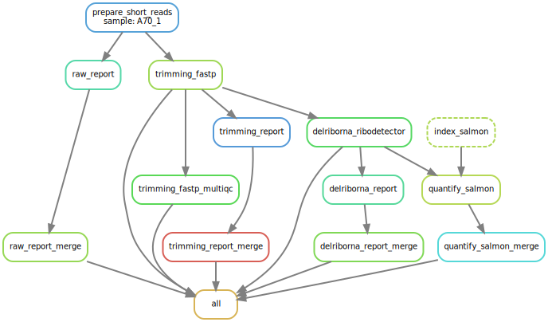

## Transcriptome analysis pipeline from RNA-seq data (WIP)

<div align=center></div>

### Feature
+ Support multi aligner or pseudo-aligner
+ Support RNA-seq and scRNA-seq data analysis


### Run
```{bash}
usage: rnapi [-h] [-v]  ...

██████╗░███╗░░██╗░█████╗░██████╗░██╗
██╔══██╗████╗░██║██╔══██╗██╔══██╗██║
██████╔╝██╔██╗██║███████║██████╔╝██║
██╔══██╗██║╚████║██╔══██║██╔═══╝░██║
██║░░██║██║░╚███║██║░░██║██║░░░░░██║
╚═╝░░╚═╝╚═╝░░╚══╝╚═╝░░╚═╝╚═╝░░░░░╚═╝

Omics for All, Open Source for All

  RNA sequence analysis pipeline

options:
  -h, --help     show this help message and exit
  -v, --version  print software version and exit

available subcommands:
  
    init         init project
    rnaseq_wf    RNA seq analysis pipeline
    scrnaseq_wf  scRNA seq analysis pipeline
```
